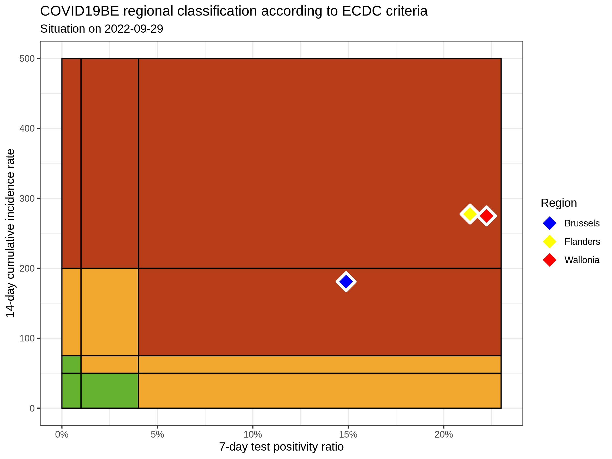

# COVID19BE

*COVID-19 epidemiology in Belgium*

## ECDC trends

### Regional classicifation according to ECDC criteria

|          | INC14 | INC7 |   TST7 | TST\_POS7 | REGION   |     POP | INC14\_RT |       PR7 |          GR |
| :------- | ----: | ---: | -----: | --------: | :------- | ------: | --------: | --------: | ----------: |
| Brussels |  7069 | 3474 |  54587 |      3957 | Brussels | 1219970 |  579.4405 | 0.0724898 | \-0.0336579 |
| Flanders | 11885 | 5496 | 144668 |      6315 | Flanders | 6653062 |  178.6395 | 0.0436517 | \-0.1397715 |
| Wallonia |  8376 | 4328 |  69755 |      4777 | Wallonia | 3648206 |  229.5923 | 0.0684825 |   0.0691700 |

### Read more

Official ECDC maps:
<https://www.ecdc.europa.eu/en/covid-19/situation-updates/weekly-maps-coordinated-restriction-free-movement>

Data source: <https://epistat.wiv-isp.be/covid/>
