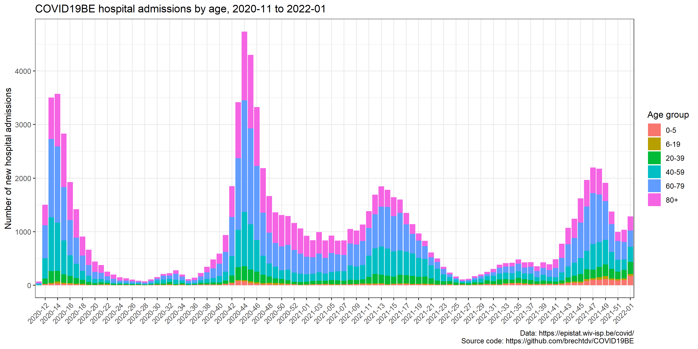
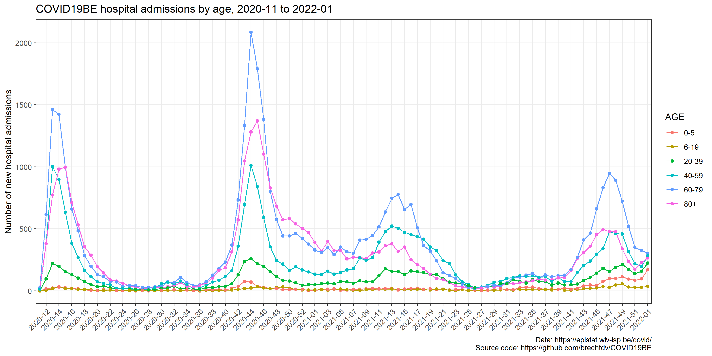
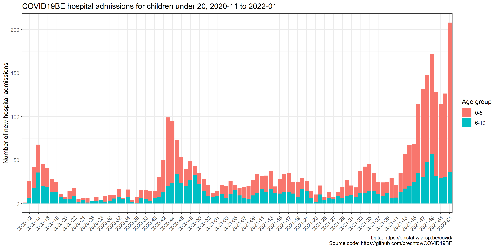

# COVID19BE
_COVID-19 epidemiology in Belgium_

## Hospitalisations by age

### COVID-19 hospitalisations by age and week - bar plot

### COVID-19 hospitalisations by age and week - line plot

### COVID-19 hospitalisations by week, children under 5

### COVID-19 hospitalisations by week, children under 20

## Data sources

- New hospital admissions: https://epistat.wiv-isp.be/covid/
- Weekly age groups proportions of new hospital admissions: https://datastudio.google.com/embed/reporting/c14a5cfc-cab7-4812-848c-0369173148ab/page/JL1qB
- Description of the COVID19 hospital surveillance in Belgium: https://archpublichealth.biomedcentral.com/articles/10.1186/s13690-020-00505-z

## Note

- These graphs provide a biased view of the number of hospitalisations by age group, because the age distribution is obtained from the Clinical Survey (including hospitalisations due to and with COVID), while the number of new hospital admissions is obtained from the Surge Capacity Survey (including only hospitalisations due to COVID).
