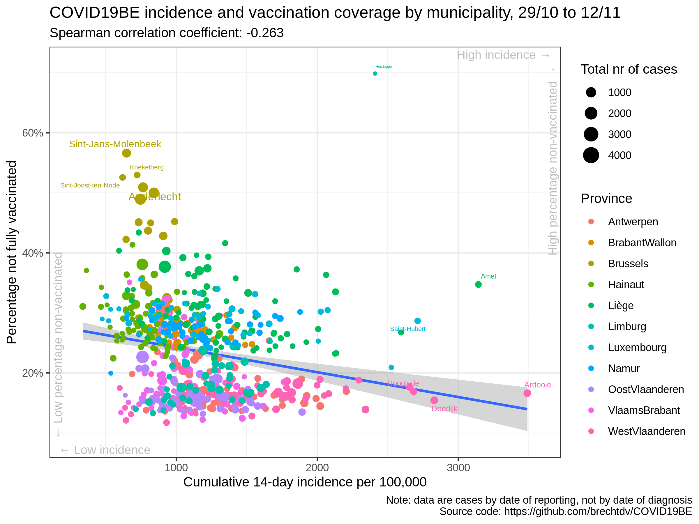
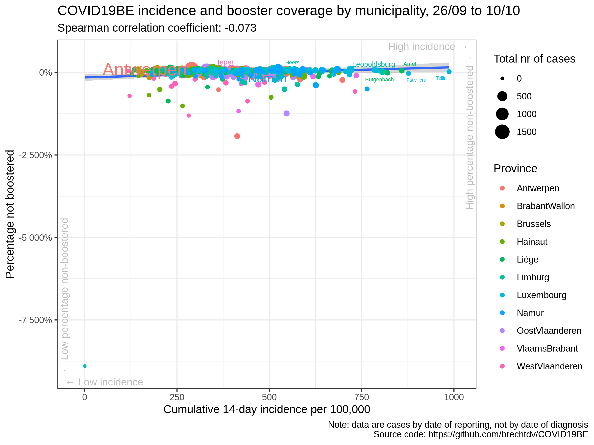

# COVID19BE

*COVID-19 epidemiology in Belgium*

## Vaccination

### COVID-19 14-day cumulative incidence vs vaccination rate by municipality

### COVID-19 14-day cumulative incidence vs booster rate by municipality

### Correlation cumulative incidence vs vaccination rate

|                | estimate.rho | p.value |
| :------------- | -----------: | ------: |
| Antwerpen      |      \-0.116 |   0.341 |
| BrabantWallon  |      \-0.058 |   0.773 |
| Brussels       |        0.063 |   0.798 |
| Hainaut        |      \-0.033 |   0.785 |
| Liège          |      \-0.043 |   0.696 |
| Limburg        |      \-0.174 |   0.269 |
| Luxembourg     |        0.007 |   0.964 |
| Namur          |        0.119 |   0.481 |
| OostVlaanderen |      \-0.027 |   0.835 |
| VlaamsBrabant  |      \-0.002 |   0.985 |
| WestVlaanderen |        0.223 |   0.077 |
| Belgium        |      \-0.073 |   0.078 |

### Correlation cumulative incidence vs booster rate

|                | estimate.rho | p.value |
| :------------- | -----------: | ------: |
| Antwerpen      |      \-0.122 |   0.319 |
| BrabantWallon  |      \-0.053 |   0.795 |
| Brussels       |        0.035 |   0.888 |
| Hainaut        |      \-0.038 |   0.758 |
| Liège          |      \-0.035 |   0.754 |
| Limburg        |      \-0.179 |   0.256 |
| Luxembourg     |        0.011 |   0.945 |
| Namur          |        0.126 |   0.455 |
| OostVlaanderen |      \-0.021 |   0.873 |
| VlaamsBrabant  |      \-0.031 |   0.805 |
| WestVlaanderen |        0.224 |   0.075 |
| Belgium        |      \-0.131 |   0.002 |

### Data source

  - <https://epistat.wiv-isp.be/covid/>
