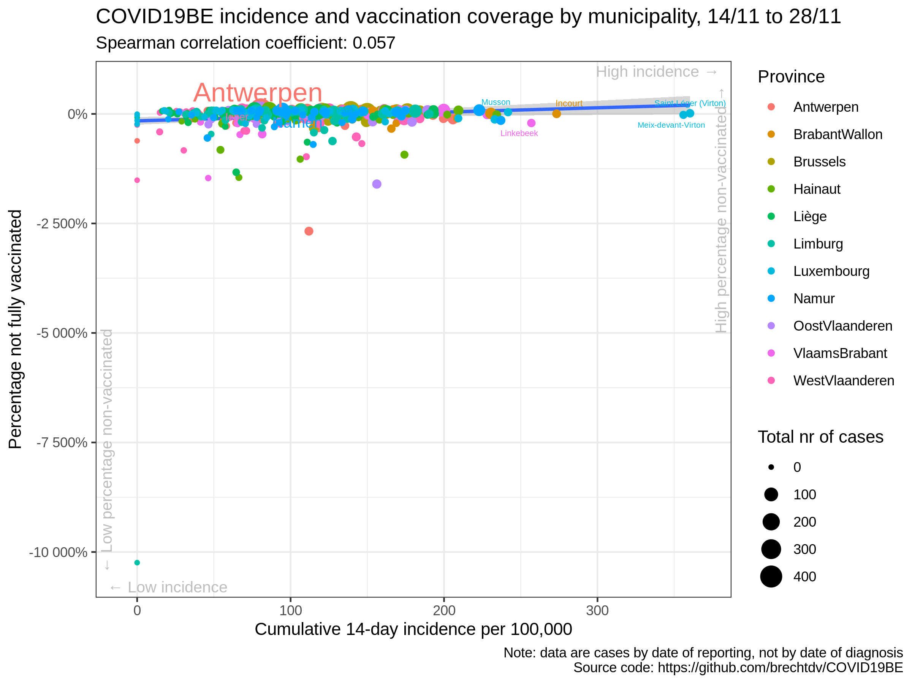

# COVID19BE

*COVID-19 epidemiology in Belgium*

## Vaccination

### COVID-19 14-day cumulative incidence vs vaccination rate by municipality

### Correlation cumulative incidence vs vaccination rate

|                | estimate.rho | p.value |
| :------------- | -----------: | ------: |
| Antwerpen      |      \-0.296 |   0.014 |
| BrabantWallon  |        0.115 |   0.567 |
| Brussels       |      \-0.856 |   0.000 |
| Hainaut        |      \-0.211 |   0.082 |
| Liège          |      \-0.244 |   0.026 |
| Limburg        |      \-0.010 |   0.952 |
| Luxembourg     |        0.007 |   0.963 |
| Namur          |        0.014 |   0.932 |
| OostVlaanderen |        0.019 |   0.886 |
| VlaamsBrabant  |      \-0.013 |   0.918 |
| WestVlaanderen |        0.221 |   0.079 |
| Belgium        |      \-0.130 |   0.002 |

### Data source

  - <https://epistat.wiv-isp.be/covid/>
