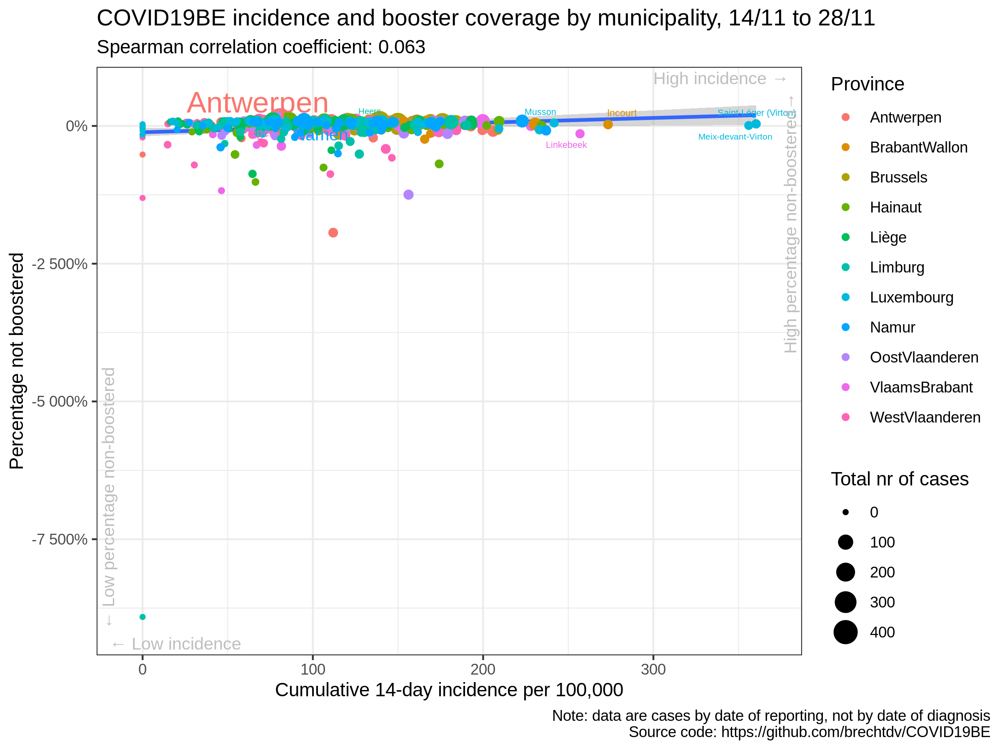

# COVID19BE

*COVID-19 epidemiology in Belgium*

## Vaccination

### COVID-19 14-day cumulative incidence vs vaccination rate by municipality

### COVID-19 14-day cumulative incidence vs booster rate by municipality

### Correlation cumulative incidence vs vaccination rate

|                | estimate.rho | p.value |
| :------------- | -----------: | ------: |
| Antwerpen      |      \-0.004 |   0.975 |
| BrabantWallon  |      \-0.483 |   0.012 |
| Brussels       |      \-0.030 |   0.905 |
| Hainaut        |      \-0.172 |   0.157 |
| Liège          |      \-0.202 |   0.065 |
| Limburg        |        0.079 |   0.617 |
| Luxembourg     |      \-0.130 |   0.401 |
| Namur          |      \-0.057 |   0.735 |
| OostVlaanderen |      \-0.167 |   0.201 |
| VlaamsBrabant  |      \-0.044 |   0.725 |
| WestVlaanderen |        0.071 |   0.576 |
| Belgium        |      \-0.061 |   0.144 |

### Correlation cumulative incidence vs booster rate

|                | estimate.rho | p.value |
| :------------- | -----------: | ------: |
| Antwerpen      |      \-0.001 |   0.992 |
| BrabantWallon  |      \-0.488 |   0.011 |
| Brussels       |      \-0.061 |   0.804 |
| Hainaut        |      \-0.172 |   0.158 |
| Liège          |      \-0.214 |   0.051 |
| Limburg        |        0.079 |   0.618 |
| Luxembourg     |      \-0.142 |   0.357 |
| Namur          |      \-0.046 |   0.785 |
| OostVlaanderen |      \-0.168 |   0.200 |
| VlaamsBrabant  |      \-0.070 |   0.579 |
| WestVlaanderen |        0.078 |   0.539 |
| Belgium        |      \-0.062 |   0.136 |

### Data source

  - <https://epistat.wiv-isp.be/covid/>
